= Texturen Tutorial
Cla Tschenett <cla.tschenett@ibw.ch>
1.0 - 10.03.2025
:toc:
:toc-title: Inhaltsverzeichnis
:icons: font
:url-quickref: https://docs.asciidoctor.org/asciidoc/latest/syntax-quick-reference/

Willkommen zum Texturen-Tutorial! In diesem Tutorial wirst du verschiedene Techniken in Photoshop kennenlernen, mit denen du Grunge-Effekte auf Schrift und Hintergründen erzeugen kannst. Wir werden uns mit Masken, Schnittmasken und Fülloptionen auseinandersetzen und du wirst sehen, wie du durch Kombination dieser Techniken realistische und spannende Effekte erzielen kannst. Folge den Schritten und lerne, wie du deine Designs mit Texturen auf ein neues Level heben kannst.

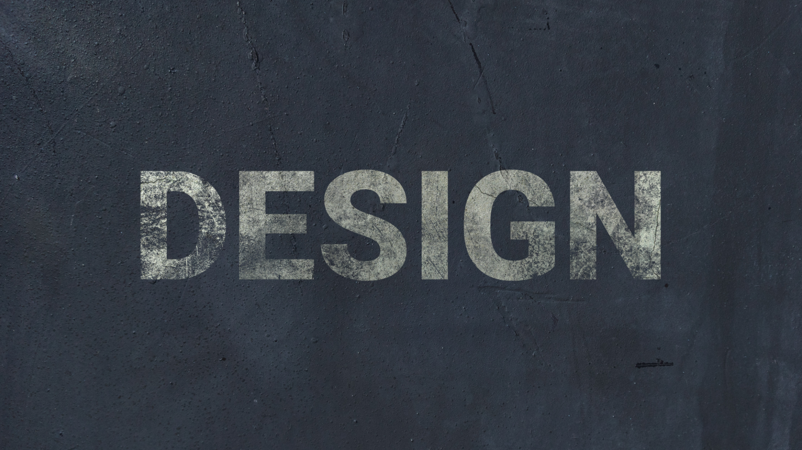

== Schritt 1: Erstellen eines neuen Dokuments
Um mit diesem Tutorial zu beginnen, öffne zunächst Photoshop und erstelle ein neues Dokument mit den Massen 3840x2160px (4K) und einem schwarzen Hintergrund. Die Auflösung von 72ppi kann übernommen werden.

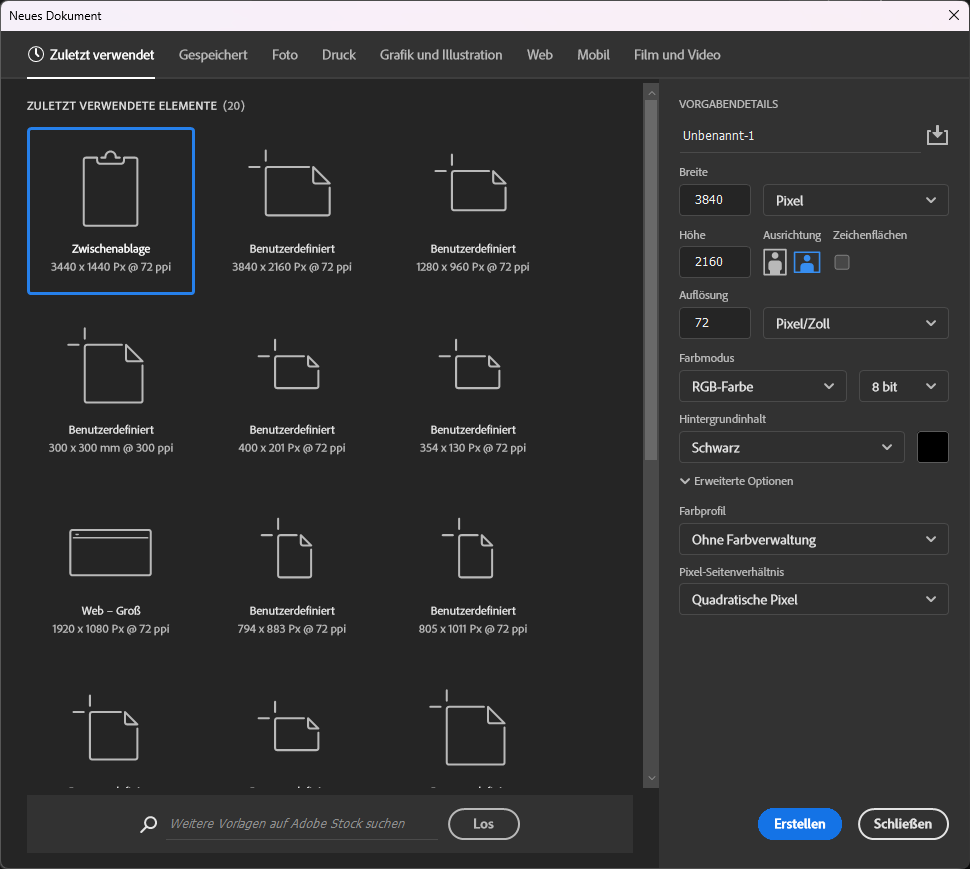

== Schritt 2: Text erstellen und Grösse anpassen

Schreibe ein Text deiner Wahl, in diesem Beispiel wird mit dem Wort `DESIGN` in der Schriftart `Roboto Black` gearbeitet.

Die Grösse kann mit `Ctrl+T` / `Cmd+T` angepasst werden.

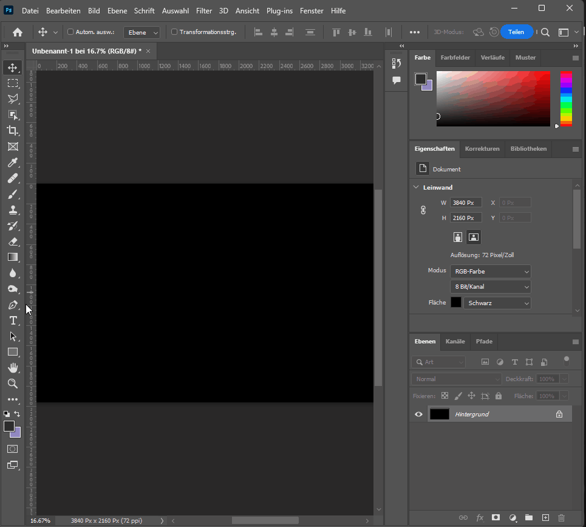

== Schritt 3: Technik Nr. 1 - Schnittmaske

Als erstes muss die Textur `Concrete.jpg` importiert werden.

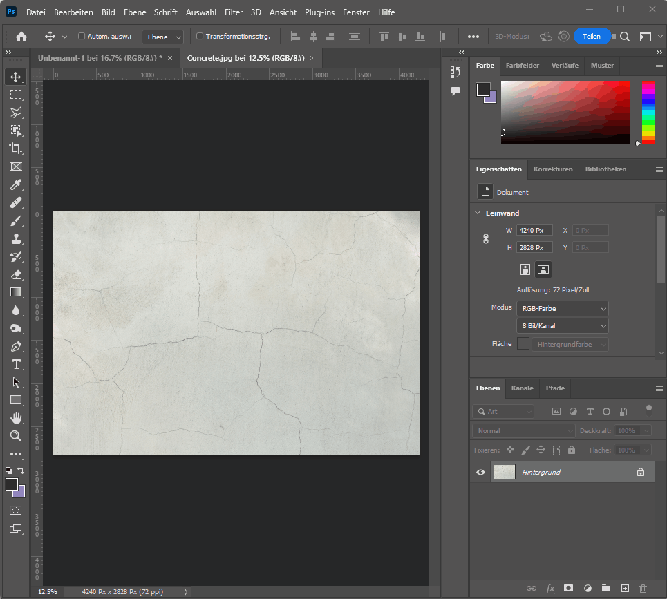

Die Ebene mit der Betontextur ist nun zuoberst in der Ebenenstruktur.

Als nächstes kann die Schnittebene erstellt werden. Diese lässt sich entweder mit Rechtsklick auf der Ebene mit der Betontextur erstellen:

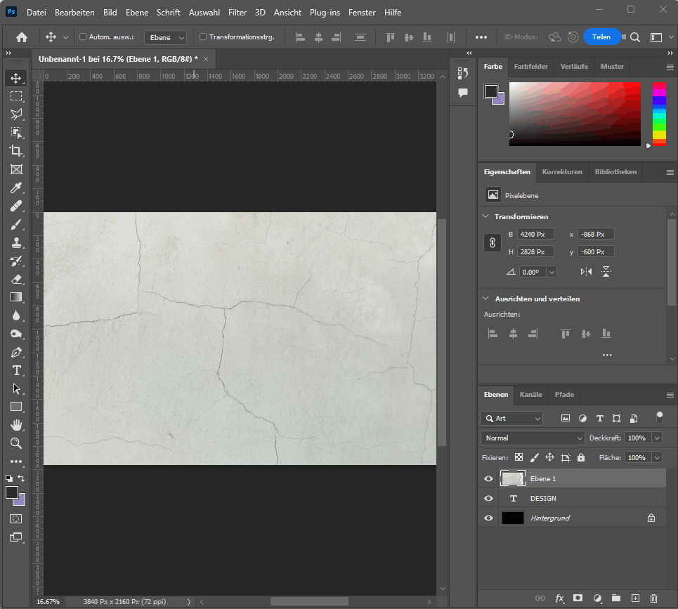

Oder mit einem `Alt` / `Option` - Klick zwischen den Ebenen.

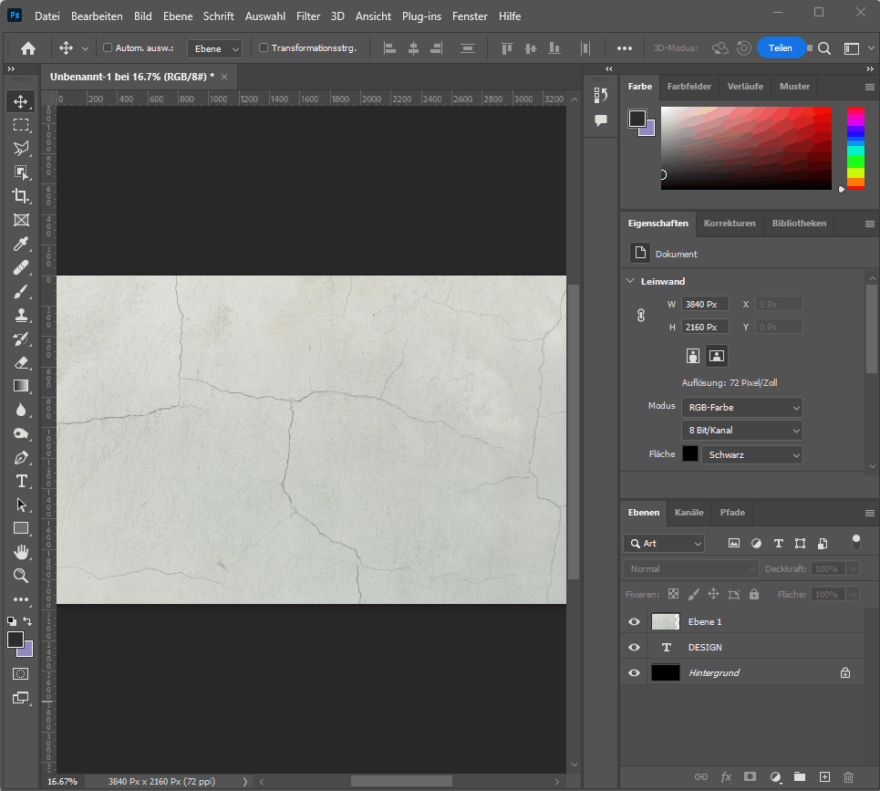

Um mehr Kontrast zu erhalten, kann die Tonwertkorrektur hilfreich sein (Levels). Hierzu bei ausgewählter Betontextur-Ebene `Ctrl+L` / `Cmd+L` drücken und die Werte anpassen bis das Bild den gewünschten Kontrast hat.

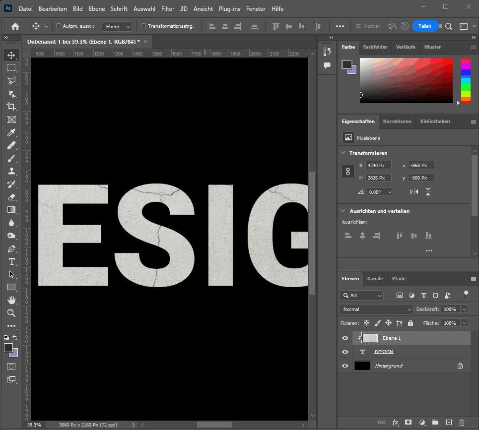

Der Vorteil dieser Schnittmasken-Methode besteht darin, dass alles was sich über der Hauptebene befindet, ebenfalls in die Schnittmaske aufgenommen werden kann. So können auch die Modi der einzelnen Ebenen angepasst werden um spezielle Effekte zu erstellen (z.B. Multiplizieren usw.)

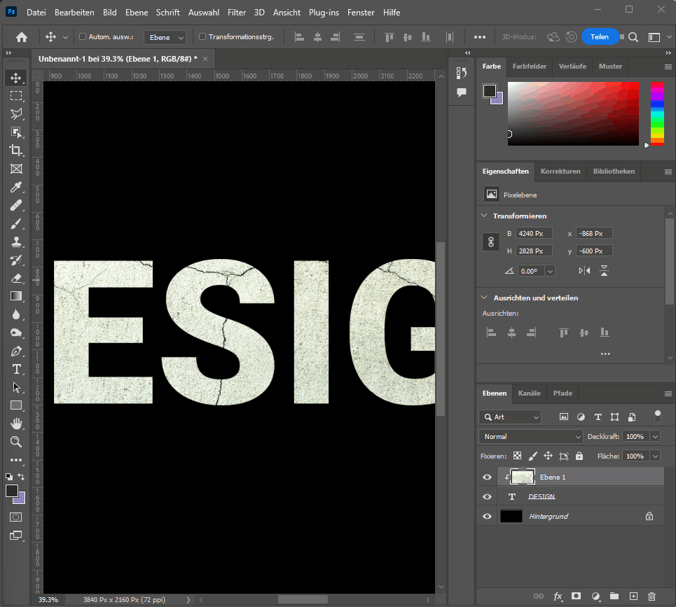

== Schritt 4: Technik Nr. 2 - Masken

Als erstes wird ein Hintergrundbild bzw. eine Hintergrundtextur benötigt.

image::images/metal.gif[]

Als nächstes musst du die Maske aus der Schrift-Ebene erstellen. Diese kann mit dem Pinsel bearbeitet werden, wobei Weiss die Pixel sichtbar macht und schwarz die Pixel abdeckt.

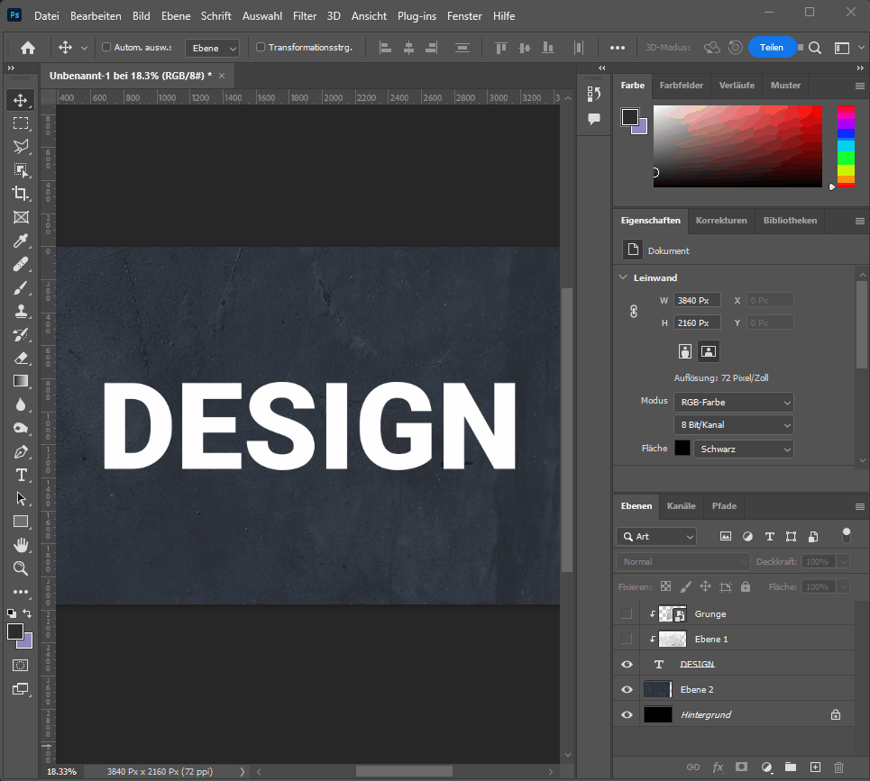

Die Maske kann aber auch aus einem Bild bestehen, hierzu muss die Maske mit gedrückter `Alt` / `Option` Taste angeklickt werden:

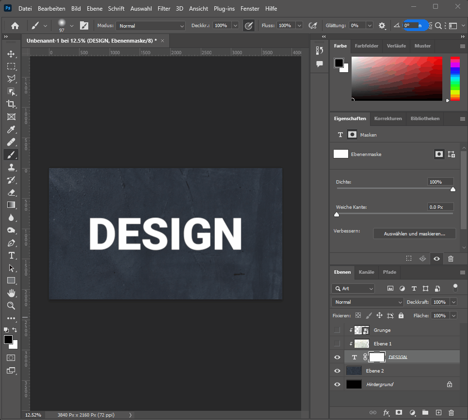

Nun kann ein Bild auf dieser Maske eingefügt werden. Hierzu muss mit `Ctrl+A` / `Cmd+A` alles ausgewählt werden, dann mit `Ctrl+C` / `Cmd+C` alles kopiert werden und anschliessend mit `Ctrl+V` / `Cmd+V`
alles auf der Maske eingefügt werden. Die Grösse des Bildes kann auf der Maske mit `Ctrl+T` / `Cmd+T` angepasst werden.

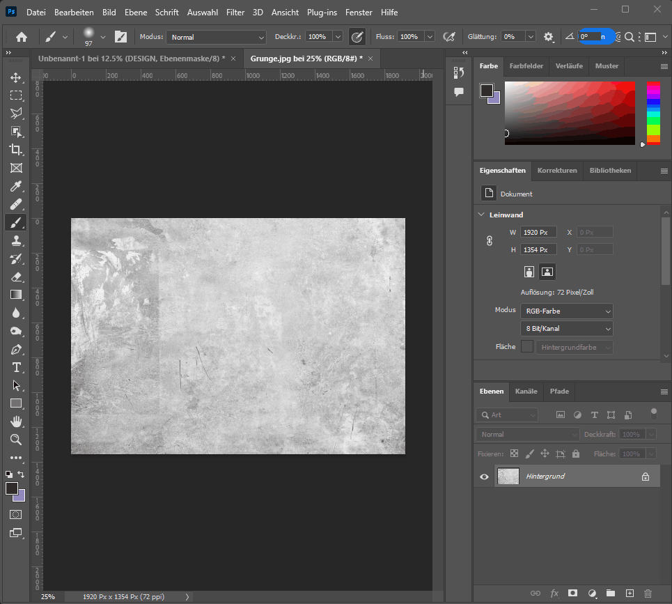

Mit `Ctrl+L` / `Cmd+L` kann anschliessend der Tonwert angepasst werden:

image::images/levels2.gif[]

== Schritt 5: Technik Nr. 3 - Fülloptionen

"Mischen, wenn..." heisst das Zauberwort. Hierzu müssen auf der Textebene die Mischoptionen geöffnet werden. Damit man einen weichen Übergang erhält, müssen die Schieberegler mit gedrückter `Alt` / `Option` Taste getrennt werden.

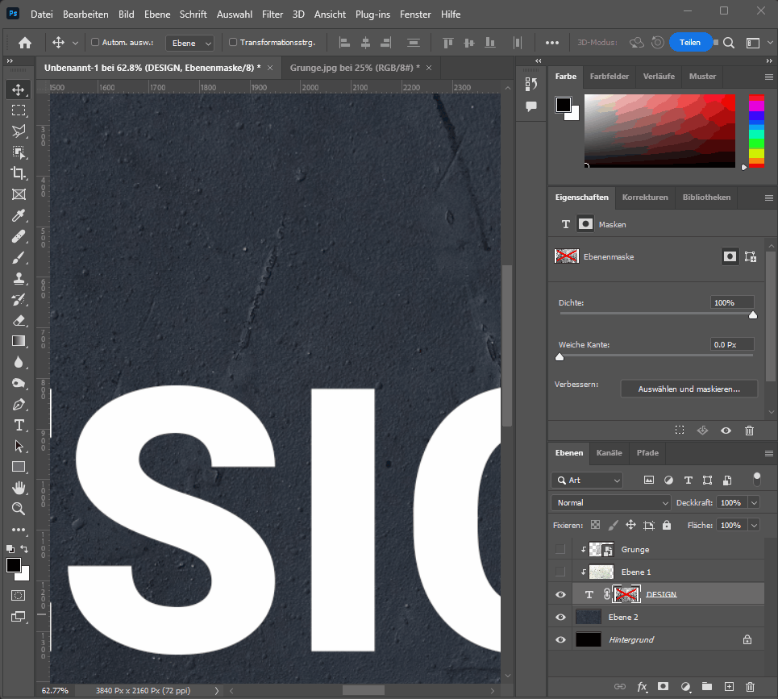

== Schritt 6: Die Kombination aus allen drei Techniken

Durch die Kombination aller drei Techniken können spannende und realistische Effekte erzielt werden. Experimentiere und spiele mit den verschiedenen Einstellungen und Optionen, um deinem Design das gewünschte Aussehen zu verpassen.

image::images/combination.gif[]
